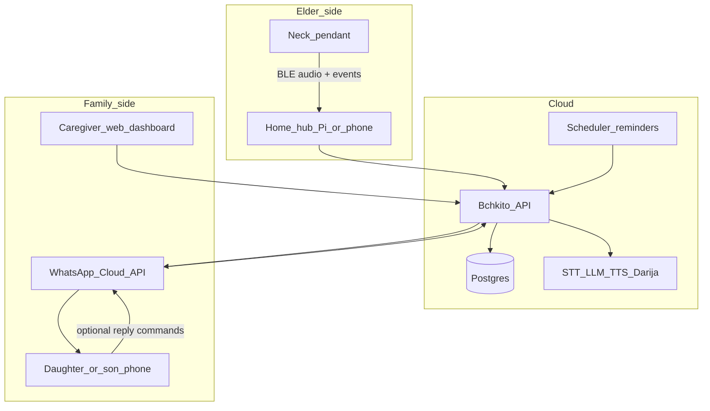
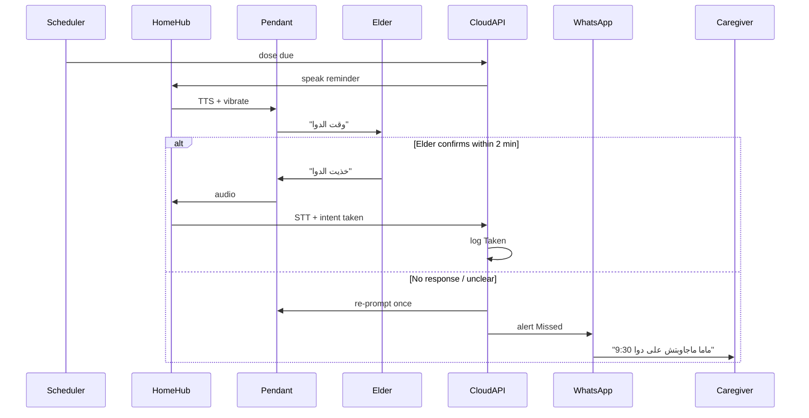

# Bchkito System Architecture (v2 — Care Pendant)

> Pivot from “cute Pi robot on a table” → **neck-worn Darija voice companion** managed entirely by family, focused on **diabetes/meds compliance**, **alone-at-home safety**, and **gentle cognitive/social engagement**.

## Product principles

1. **Elderly never configure tech.** No typing, no passwords, no app stores. At most: one big button + voice in Darija.
2. **Family operates the system.** Adult children (caregivers) set meds, schedules, contacts, and receive alerts on WhatsApp + a web dashboard.
3. **Voice is the interface.** Reminders, confirmations, SOS, and games are spoken.
4. **WhatsApp is the family rail.** Moroccans already live there; don’t invent a second chat app for caregivers.
5. **Health = reminders + logs, not a medical device.** No insulin dose calculation, no diagnosis. Escalate to family/doctor language only.
6. **Always close to the body.** Pendant form factor, not a shelf robot.

---

## Recommended architecture (MVP target)

**Split brain:** thin wearable + home hub + cloud.



### Why not put the whole Raspberry Pi around the neck?

| Approach | Pros | Cons | Verdict |
|----------|------|------|---------|
| Pi 5 as pendant | Powerful local AI | Heavy, hot, poor battery, unsafe cable, not wearable | Reject |
| Full AI on tiny MCU | Offline | Weak Darija, huge battery, cost | Reject for MVP |
| **Thin pendant + home hub + cloud** | Light, cheap, good audio path, family dashboard | Needs home Wi‑Fi (or LTE upgrade) | **Choose this** |

The “robot” personality stays; the **body** becomes a **locket/pendant**, and the **brain** lives in a plugged-in hub + cloud.

---

## Hardware: form factor & budget tiers

### Physical design (neck)

- Soft cord / breakaway clasp (safety if snagged)
- Large **SOS / Talk** button (tactile, high-contrast)
- Mic + speaker aimed toward mouth/chest
- LED ring: idle / listening / reminder / alert
- Optional vibration motor for hard-of-hearing cue
- IP54-ish splash resistance goal
- Target weight: **&lt; 45 g** electronics+shell for daily wear

### Bill of materials (3 tiers)

#### Tier A — Home-only MVP (~$35–50 electronics)

| Part | Example | Role | ~USD |
|------|---------|------|------|
| MCU + BLE/WiFi | ESP32-S3 | Button, LED, mic codec, BLE audio bridge | 4–7 |
| Mic | I2S MEMS | Capture Darija | 1–2 |
| Speaker + amp | 28–36 mm + MAX98357 | Spoken reminders | 3–5 |
| Battery | 500–800 mAh LiPo | 12–24 h with duty cycling | 3–5 |
| Charging | USB-C + TP4056 | Overnight charge | 1–2 |
| IMU (optional later) | MPU6050 | Rough fall / freefall hint | 2 |
| Enclosure + cord | Custom 3D / soft silicone | Wearable | 5–10 |
| **Home hub** | Used Android phone **or** Pi Zero 2 W / Pi 4 | Audio gateway + local cache | 15–60 |

**Best first build.** Works while grandma is at home on Wi‑Fi. Hub stays plugged in (kitchen / living room).

#### Tier B — Practical care (~$70–100 electronics + hub)

Tier A + better speaker, larger battery (1000–1200 mAh), IMU fall heuristics, vibration, nicer enclosure. Hub = dedicated Pi 4/5.

#### Tier C — Always-reachable (~$130–200)

Add **LTE-M / 4G Cat-1 bis** modem + SIM (e.g. Quectel EG91/BG95 class). SOS works outside / when home Wi‑Fi dies. Higher cost + monthly data (~$2–5).

**Recommendation:** ship **Tier A software architecture** now; design PCB so Tier C modem is a daughterboard option later.

---

## Software components (rethought)

### 1) Neck pendant firmware (tiny)

Responsibilities only:

- Wake on button / scheduled buzz from hub
- Stream or chunk PCM audio to hub over BLE (or Wi‑Fi if in range)
- Play TTS audio pushed from hub
- Local SOS: long-press → immediate event (even if AI is down)
- Battery % + heartbeat

**No** Whisper, **no** LLM on the pendant.

### 2) Home hub (Pi or always-on Android)

- Keeps BLE link to pendant
- Runs local queue if internet drops (“reminder due — retry”)
- Optional local Whisper tiny for low-latency “خذيت الدواء”
- Forwards events to cloud API
- Can speak through pendant or a room speaker as fallback

### 3) Cloud API + Caregiver Dashboard (web)

Family-facing (Arabic UI + French optional):

| Module | Caregiver actions |
|--------|-------------------|
| **People** | Elder profile, city, language Darija, hearing volume |
| **Medications** | Name, dose text, schedule, type (insulin / oral / other) |
| **Diabetes** | Check times, log entries (value optional), notes |
| **Compliance** | Timeline: Taken / Missed / Skipped / No response |
| **Alerts** | WhatsApp + in-dashboard; escalation rules |
| **Appointments** | Doctor calendar → spoken reminders day-before / morning-of |
| **Safety** | Emergency contacts, SOS message templates |
| **Social** | Enable/disable games, quiet hours |
| **Device** | Battery, last seen, test call |

Elder **never** opens this.

### 4) WhatsApp Family Bridge (caregiver channel)

Outbound (system → daughter/son):

- Missed med after grace period
- SOS / “ما بخير” / fall suspicion
- Daily digest: “3/4 doses taken”
- Low battery / pendant offline

Inbound (caregiver → system) via WhatsApp keywords or dashboard buttons:

- `تم` / “I called her”
- Snooze reminder
- Mark dose given manually

### 5) Darija Voice Care OS (skills)

| Skill | Example |
|-------|---------|
| Med reminder | “السلام، دابا 9 و النص، وقت الإنسولين / الدوا” |
| Confirm | Elder: “خذيت الدوا” → log Taken |
| Miss / skip | “مازال ماخذيتوش” / silence → escalate |
| Blood sugar prompt | “واش قستي السكر؟ شحال؟” (optional number via voice or caregiver later) |
| SOS | “عيّطي لبنتي” / long-press |
| Companionship | Short chat (existing Bchkito persona) |
| Weather / news | Keep as optional social (existing Info Hub) |
| Mind games | 2-minute Darija quizzes (memory, proverb, numbers) |
| Morning briefing | Soft “صباح الخير” + meds ahead today |

---

## Critical care flows

### Medication compliance



**Grace policy (configurable by family):**

1. T+0: reminder  
2. T+1–2 min: gentle repeat  
3. T+2–5 min: WhatsApp alert to primary caregiver  
4. Optional T+10 min: secondary contact  

### SOS / “I’m not okay”

Triggers:

- Long-press button (≥2 s)
- Voice: “عيطي لبنتي”، “بغيت المساعدة”، “طحت”، “ما بخير”

Actions (parallel):

1. Immediate WhatsApp to primary + secondary contacts  
2. Dashboard red banner + optional push  
3. Spoken: “واخا، غنقولو لبناتك دابا”  
4. Optional: open 60 s live listen-in **only if family enabled** (privacy default OFF)

### Fall detection (honest scope)

IMU “fall detection” on cheap hardware has high false positives. MVP:

- Treat IMU as **soft signal** → ask “واش بخير؟”  
- Only escalate if no answer or explicit SOS  
- Never claim certified medical fall detection  

---

## Data model (core)

```
Caregiver 1──* Elder
Elder 1──* Medication (name, dose_label, route: oral|insulin|other)
Medication 1──* ScheduleRule (cron / times_of_day, timezone Africa/Casablanca)
Elder 1──* DoseEvent (scheduled_at, status: pending|taken|missed|skipped|unknown, source: voice|caregiver|timeout)
Elder 1──* GlucoseLog (at, value_mg_dl nullable, note)
Elder 1──* VitalLog (bp_sys, bp_dia, optional)
Elder 1──* Appointment
Elder 1──* Alert (type, severity, channel, acked_at)
Elder 1──* Device (pendant_id, hub_id, battery, last_seen)
```

Privacy: health data encrypted at rest; caregivers see only their linked elders; no public profiles.

---

## Mind games & daytime companionship (anti-isolation)

Short **voice-only** sessions (2–4 minutes), scheduled mid-morning / late afternoon when family at work:

- Number span (repeat digits)
- Simple Darija riddles / proverbs
- “شنو طيبتي اليوم؟” journaling prompt logged for family
- Prayer-time friendly quiet hours (configurable)

Goal: engagement + presence, not gamification addiction. Scores visible to family as “active minutes,” not competitive rankings.

---

## What happens to the previous Pi “robot” MVP?

| Old component | Fate in v2 |
|---------------|------------|
| Darija Voice OS | Moves to hub/cloud; pendant is mic/speaker |
| Info Hub weather/news | Remains as optional social skills |
| WhatsApp Family Bridge | Becomes **primary caregiver alert rail** |
| Tabletop Pi + speaker | Becomes **home hub** (or replaced by spare phone) |
| Cute robot shell | Optional dock that charges the pendant |

---

## Safety, ethics, compliance (non-negotiable)

- Label clearly: **reminder & communication aid**, not a medical device / not for dosing decisions  
- No autonomous insulin advice (“take 8 units”) — only caregiver-authored reminder text  
- Consent: elder + caregiver; SOS contacts opt-in  
- False alert fatigue: tunable thresholds; caregiver can snooze  
- Morocco: store data with clear retention; WhatsApp templates must follow Meta policies  

---

## Suggested delivery phases (replaces pure “90-day robot”)

| Phase | Weeks | Outcome |
|-------|-------|---------|
| **P0 Architecture spike** | 1–2 | Pendant audio BLE prototype + dashboard wireframes + data model |
| **P1 Care loop** | 3–6 | Med schedules, Darija reminder/confirm, WhatsApp miss alerts, compliance log |
| **P2 SOS + dashboard polish** | 7–9 | Long-press SOS, caregiver ack, appointments, battery/offline alerts |
| **P3 Diabetes logs + games** | 10–12 | Glucose prompts, simple mind games, daily WhatsApp digest |
| **P4 Wearable hardening** | 13–16 | Enclosure, battery life, field test with 3 families |

Budget for first 10 prototypes (Tier A): expect **~$80–150 fully assembled** each including husk + hub if buying new Pis; cheaper with recycled Android hubs.

---

## Default stack recommendation

| Layer | Choice |
|-------|--------|
| Pendant | ESP32-S3 + I2S mic + amp + LiPo + big button |
| Hub | Raspberry Pi 4/5 **or** old Android phone running companion app |
| Backend | Python FastAPI (extends current `bchkito`) + Postgres |
| Dashboard | Simple web (React or server-rendered) Arabic RTL |
| Voice AI | Cloud STT/LLM/TTS multicloud (keep local Whisper on hub as fallback) |
| Family messaging | WhatsApp Cloud API |
| Scheduler | Cloud cron (timezone `Africa/Casablanca`) |

---

## Explicit non-goals for first release

- Replacing doctor / glucometer / CGM  
- Guaranteed fall detection  
- Fully offline Darija LLM on the pendant  
- Elder-facing smartphone app  
- Multi-elder nursing-home fleet features  

---

## Decision summary

**Bchkito v2 = neck pendant (body) + home hub (ears/mouth gateway) + cloud care OS (brain) + WhatsApp (family nerve).**  
Family runs the dashboard; elder only speaks and presses one button. Diabetes/meds are the spine; companionship games and SOS keep alone-daytime safer and kinder.
